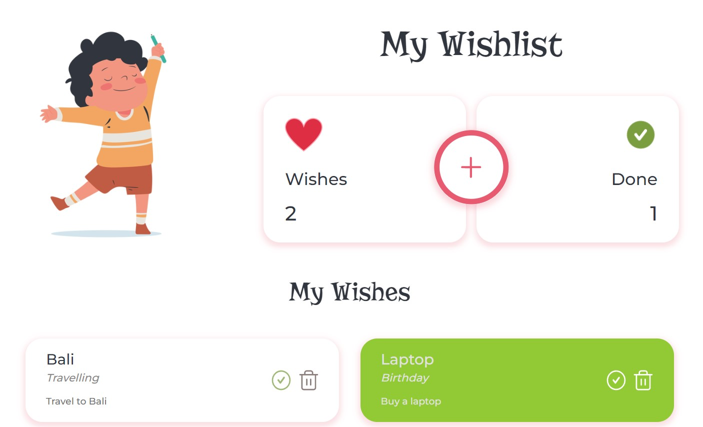

# Wishlist React Project

This is a learning project created with React. It allows users to create a wishlist, where they can add, mark and delete wishes.
Browser Local Storage is used to store data.

## Setup

Install dependencies:
``` npm i ```

Start project in development mode:
``` npm start ```